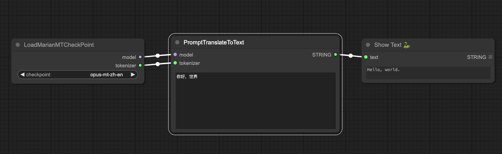

# ComfyUI_kkTranslator_nodes

These nodes are mainly used to translate prompt words from other languages into English.

## Install
1. Clone this repository to the custom of ComfyUI_ In the nodes folder。
```
cd custom_nodes
git clone https://github.com/chaojie/ComfyUI-DragNUWA
```
2. Run the following command to install dependencies
```
python -m pip install -r requirements.txt
```
3. Restart your ComfyUI

## Usage
Download this workflow to view the demonstration: [marian_mt_workflow](./marian_mt_workflow.json)


